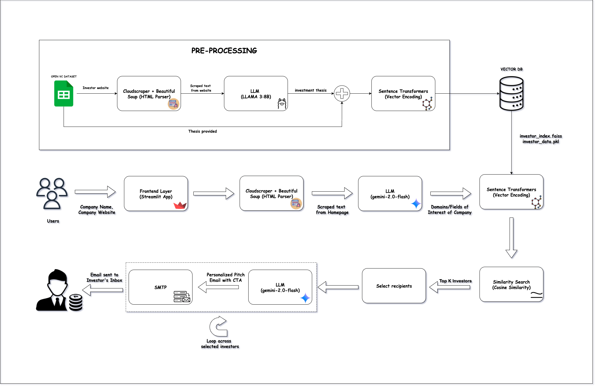

# 🚀 Auto_Pitch_Agent

> **Automate your investor outreach with AI-powered precision.**  
> Identify the right investors and send **personalized cold emails** in minutes — powered by **Google Gemini** and **LangGraph**.

---

## 📌 Overview

💡 Manual investor research is **slow**. Cold emailing is **repetitive**.  
**Auto_Pitch_Agent** solves both problems with a **fully automated pipeline**:

1️⃣ **Company Profiling** → Generates a startup profile with domain insights.  
2️⃣ **Investor Matching** → Finds investors aligned with your business area.  
3️⃣ **Email Drafting** → Creates highly personalized cold emails.  
4️⃣ **Automated Email Sending** → Sends to relevant investors with validation checks.

---

## ✨ Key Features

| 🚀 Feature | 💡 Description |
|------------|----------------|
| 🧠 **Natural Language Understanding** | Google Gemini interprets the startup's domain & industry. |
| 🔍 **Flexible Domain Matching** | Matches even with variations (`"AI & Data Science"` ↔ `"data science ai"`). |
| ⚙ **LangGraph Workflow** | Modular, state-driven execution for smooth orchestration. |
| 📧 **Automated Outreach** | Sends emails via SMTP, skipping invalid/placeholder addresses. |

---

## 🛠 Tech Stack

**💻 Language & AI**  
- Python 3.9+  
- [Google Gemini API](https://ai.google.dev/)  
- [LangGraph](https://www.langchain.com/langgraph)  

**📊 Data Handling**  
- Pandas  

**📨 Email Automation**  
- SMTP  

**🔐 Security**  
- dotenv for environment variables  

---

## 🗂 HLD

