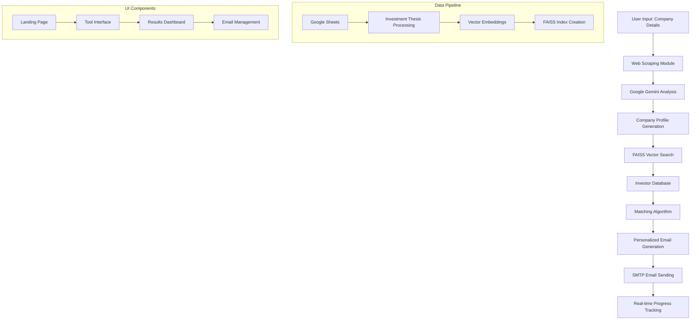

# 🚀 Auto Pitch Agent

[](https://www.python.org/)
[](https://streamlit.io/)
[](https://ai.google.dev/)
[](https://github.com/facebookresearch/faiss)
[](LICENSE)

> **Revolutionize your investor outreach with AI-powered precision.**  
> Identify the right investors, generate personalized emails, and automate outreach — all powered by **Google Gemini AI** and **semantic vector search**.

---

## 📌 Overview

Manual investor research is **time-consuming**. Cold emailing is **repetitive** and often ineffective.  

**Auto Pitch Agent** solves both problems with a **fully automated AI pipeline**:

1️⃣ **🔍 Company Analysis** → AI analyzes your website to extract business domains and focus areas  
2️⃣ **🎯 Smart Investor Matching** → Semantic search finds investors aligned with your business  
3️⃣ **📝 Personalized Email Generation** → AI crafts tailored cold emails for each investor  
4️⃣ **📧 Automated Outreach** → Sends emails with validation and real-time tracking  

---

## ✨ Key Features

| 🚀 Feature | 💡 Description |
|------------|----------------|
| 🤖 **AI-Powered Company Analysis** | Google Gemini analyzes your website to understand business domains and create comprehensive profiles |
| 🔍 **Semantic Investor Matching** | FAISS vector search with sentence transformers for intelligent investor-startup alignment |
| 📧 **Personalized Email Generation** | AI generates tailored cold emails highlighting portfolio fit and investment thesis alignment |
| 🎯 **Smart Email Validation** | Robust email validation, sanitization, and deliverability checks |
| 📊 **Interactive Dashboard** | Beautiful Streamlit interface with real-time progress tracking and analytics |
| 🔒 **Enterprise Security** | Environment variable management, secure SMTP integration, and data protection |
| ⚡ **Real-time Processing** | Live progress updates, log streaming, and instant feedback |

---

## 🛠 Technology Stack

### 🧠 **AI & Machine Learning**
- **Google Gemini 2.0 Flash** - Advanced text analysis and email generation
- **Sentence Transformers** (`all-distilroberta-v1`) - Semantic text embeddings
- **FAISS** - High-performance vector similarity search
- **Ollama** - Alternative LLM support

### 📊 **Data Processing & Storage**
- **Pandas** - Data manipulation and analysis
- **Google Sheets API** - Dynamic investor data management
- **Beautiful Soup & CloudScraper** - Robust web scraping
- **Pickle & CSV** - Data serialization and export

### 🖥 **Frontend & Infrastructure**
- **Streamlit** - Interactive web application
- **Python 3.9+** - Core runtime
- **SMTP Integration** - Multi-provider email delivery
- **Environment Variables** - Secure configuration management

---

## 🏗 System Architecture



---

## 🚀 Quick Start

### Prerequisites
- Python 3.9 or higher
- Google Gemini API key
- SMTP email credentials
- Google Sheets access (optional)

### 1. Clone & Install
```bash
git clone https://github.com/your-username/Auto_Pitch_Agent.git
cd Auto_Pitch_Agent
pip install -r requirements.txt
```

### 2. Environment Setup
Create a `.env` file in the project root:
```env
# Required: Google Gemini API
GEMINI_API_KEY=your_gemini_api_key_here
LLM_MODEL=gemini-2.0-flash

# Required: Email Configuration
SMTP_HOST=smtp.gmail.com
SMTP_PORT=587
SMTP_USERNAME=your_email@gmail.com
SMTP_PASSWORD=your_app_password
EMAIL_FROM=your_email@gmail.com
FROM_NAME=Your Name

# Optional: Default Signature
FOUNDER_NAME=Your Name
FOUNDER_EMAIL=your_email@domain.com
FOUNDER_PHONE=+1-234-567-8900
FOUNDER_LINKEDIN=https://linkedin.com/in/yourprofile

# Optional: Settings
DRY_RUN=true
```

### 3. Launch Application
```bash
# Streamlit Web Interface (Recommended)
streamlit run streamlit_app.py

# Command Line Interface
python main.py
```

### 4. Access the Application
Open your browser to `http://localhost:8501` for the interactive web interface.

---

## 📖 Usage Guide

### 🌐 **Web Interface**

1. **Landing Page**: Learn about features and capabilities
2. **Company Analysis**: 
   - Enter your company name and website URL
   - AI automatically scrapes and analyzes your homepage
   - Generates business domain summary

3. **Investor Matching**:
   - Semantic search finds relevant investors
   - Configurable match count (1-25 investors)
   - Review match quality and similarity scores

4. **Email Campaign**:
   - Select target investors from matches
   - Configure signature and sender details
   - Generate personalized emails
   - Send with real-time progress tracking

### 💻 **Command Line Interface**

```bash
python main.py
```
Follow the interactive prompts to:
- Enter company details
- Review analysis results
- Confirm email sending preferences
- Monitor sending progress

---

## 📁 Project Structure

```
Auto_Pitch_Agent/
├── 📱 Frontend & UI
│   ├── streamlit_app.py          # Main Streamlit application
│   ├── app.py                    # Alternative Streamlit interface
│   └── assets/                   # Static assets (images, etc.)
│
├── 🤖 Core AI Modules
│   ├── m1_analyze_company.py     # Company website analysis
│   ├── m2_investor_match.py      # Semantic investor matching
│   └── m3_email_sender.py        # Personalized email generation & sending
│
├── 📊 Data Processing
│   ├── p_1_investment_thesis_preprocessing.py  # Investor data enrichment
│   ├── p_2_vectorization_preprocessing.py     # Vector embedding creation
│   ├── investor_data.pkl                      # Processed investor database
│   └── investor_index.faiss                   # FAISS search index
│
├── 🔧 Configuration & Setup
│   ├── requirements.txt          # Python dependencies
│   ├── .env                      # Environment variables (create this)
│   ├── service_account.json      # Google Sheets credentials (optional)
│   └── main.py                   # CLI entry point
│
└── 📚 Documentation
    ├── README.md                 # This file
    ├── EDA.ipynb                # Exploratory data analysis
    └── icon.png                 # Application icon
```

---

## ⚙️ Configuration

### 🔑 **Required Environment Variables**

| Variable | Description | Example |
|----------|-------------|---------|
| `GEMINI_API_KEY` | Google Gemini API key | `AIzaSy...` |
| `SMTP_HOST` | Email server hostname | `smtp.gmail.com` |
| `SMTP_USERNAME` | Email authentication username | `your@email.com` |
| `SMTP_PASSWORD` | Email authentication password | `app_password` |

### 🛠 **Optional Configuration**

| Variable | Default | Description |
|----------|---------|-------------|
| `LLM_MODEL` | `gemini-2.0-flash` | Gemini model variant |
| `SMTP_PORT` | `587` | SMTP server port |
| `DRY_RUN` | `true` | Test mode (no actual emails) |
| `FOUNDER_NAME` | - | Default signature name |
| `FOUNDER_EMAIL` | - | Default signature email |

### 📧 **SMTP Provider Setup**

<details>
<summary>Gmail Configuration</summary>

1. Enable 2-Factor Authentication
2. Generate App Password: Google Account → Security → App passwords
3. Use app password in `SMTP_PASSWORD`

```env
SMTP_HOST=smtp.gmail.com
SMTP_PORT=587
SMTP_USERNAME=your@gmail.com
SMTP_PASSWORD=your_16_char_app_password
```
</details>

<details>
<summary>Outlook/Office 365</summary>

```env
SMTP_HOST=smtp.office365.com
SMTP_PORT=587
SMTP_USERNAME=your@outlook.com
SMTP_PASSWORD=your_password
```
</details>

---

## 🔄 Data Pipeline

### 📊 **Investor Database Setup**

1. **Google Sheets Integration**:
   ```bash
   # Update investor data from Google Sheets
   python p_1_investment_thesis_preprocessing.py
   ```

2. **Vector Index Creation**:
   ```bash
   # Generate FAISS search index
   python p_2_vectorization_preprocessing.py
   ```

3. **Data Files Generated**:
   - `investor_data.pkl` - Processed investor profiles
   - `investor_index.faiss` - Semantic search index

### 🎯 **Matching Algorithm**

The semantic matching process:
1. **Text Preprocessing**: Clean and normalize investment thesis data
2. **Embedding Generation**: Convert text to vector representations
3. **Similarity Search**: FAISS cosine similarity matching
4. **Ranking**: Score and rank investors by relevance

---

## 📈 Performance & Scalability

- **Processing Speed**: ~100 investors/second for matching
- **Memory Usage**: ~500MB for 10K investor database
- **Email Throughput**: Limited by SMTP provider (typically 100-500/day)
- **Concurrent Users**: Supports multiple Streamlit sessions

---

## 🛡️ Security & Privacy

- ✅ **Environment Variables**: Secure credential management
- ✅ **Email Validation**: Robust sanitization and validation
- ✅ **Error Handling**: Graceful failure management
- ✅ **Rate Limiting**: SMTP provider compliance
- ✅ **Data Privacy**: No sensitive data logging

---

## 🧪 Testing

### **Dry Run Mode**
Test the complete pipeline without sending emails:
```env
DRY_RUN=true
```

### **Email Validation**
The system automatically:
- Validates email format and domains
- Sanitizes common obfuscation patterns
- Skips invalid/placeholder addresses
- Provides detailed error reporting

---

## 🤝 Contributing

We welcome contributions! Please:

1. Fork the repository
2. Create a feature branch (`git checkout -b feature/amazing-feature`)
3. Commit changes (`git commit -m 'Add amazing feature'`)
4. Push to branch (`git push origin feature/amazing-feature`)
5. Open a Pull Request

### **Development Setup**
```bash
# Install development dependencies
pip install -r requirements.txt

# Run tests
python -m pytest tests/

# Format code
black *.py
```

---

## 📜 License

This project is licensed under the MIT License - see the [LICENSE](LICENSE) file for details.

---

## 🙋‍♂️ Support & Documentation

- **Issues**: [GitHub Issues](https://github.com/your-username/Auto_Pitch_Agent/issues)
- **Discussions**: [GitHub Discussions](https://github.com/your-username/Auto_Pitch_Agent/discussions)
- **Email**: support@autopitchagent.com

---

## 🎯 Roadmap

- [ ] **Multi-language Support** - Internationalization
- [ ] **Advanced Analytics** - Email open/click tracking
- [ ] **CRM Integration** - Salesforce, HubSpot connectors
- [ ] **Template Library** - Industry-specific email templates
- [ ] **A/B Testing** - Email variant optimization
- [ ] **Mobile App** - iOS/Android companion app

---

## 🏆 Acknowledgments

- **Google Gemini** for advanced AI capabilities
- **FAISS** for high-performance vector search
- **Streamlit** for rapid UI development
- **Open VC Dataset** for investor information
- **Contributors** who make this project possible

---

<div align="center">

**🚀 Ready to revolutionize your fundraising?**

[Get Started](https://github.com/your-username/Auto_Pitch_Agent) • [Documentation](https://docs.autopitchagent.com) • [Support](mailto:support@autopitchagent.com)

---

*© 2025 Auto Pitch Agent. Connecting startups with the right investors.*

</div>